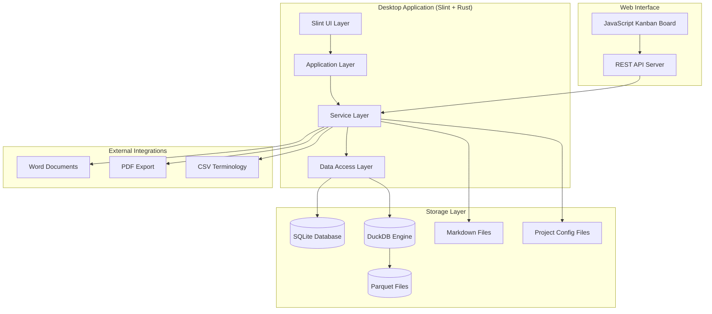

# Design Document

## Overview

The Translation Management System is a comprehensive solution that integrates project management, document import, translation memory, collaborative editing, and export capabilities. The system is built on a hybrid architecture combining a Rust-based Slint desktop application for the main editing interface with a web-based JavaScript Kanban board for project management.

The core architecture leverages DuckDB with Parquet files for efficient translation memory storage, SQLite for project metadata, and a file-based structure for markdown documents. The system supports real-time collaboration through role-based access control and provides advanced features like sentence chunking, terminology management, and multi-format export.

## Architecture

### High-Level Architecture



### Component Architecture

The system follows a layered architecture with clear separation of concerns:

1. **Presentation Layer**: Slint UI components and web-based Kanban interface
2. **Application Layer**: Business logic coordination and workflow management
3. **Service Layer**: Domain-specific services for translation, project management, and collaboration
4. **Data Access Layer**: Repository pattern for data persistence and retrieval
5. **Storage Layer**: Multiple storage backends optimized for different data types

### Technology Stack

- **Desktop UI**: Slint framework for native cross-platform interface
- **Backend**: Rust with Tokio for async operations
- **Web UI**: Vanilla JavaScript with modern ES6+ features
- **Translation Memory**: DuckDB with Parquet columnar storage
- **Project Data**: SQLite for relational data and metadata
- **Document Storage**: File-based markdown with structured directories
- **Export Engine**: Custom PDF generation with markdown rendering

## Components and Interfaces

### Core Services

#### ProjectService
Manages project lifecycle, configuration, and structure.

```rust
pub struct ProjectService {
    project_repository: Arc<ProjectRepository>,
    file_manager: Arc<FileManager>,
    config_manager: Arc<ConfigManager>,
}

impl ProjectService {
    pub async fn create_project(&self, request: CreateProjectRequest) -> Result<Project>;
    pub async fn load_project(&self, project_id: Uuid) -> Result<ProjectStructure>;
    pub async fn configure_languages(&self, project_id: Uuid, config: LanguageConfig) -> Result<()>;
    pub async fn add_team_member(&self, project_id: Uuid, member: TeamMember) -> Result<()>;
    pub async fn get_project_status(&self, project_id: Uuid) -> Result<ProjectStatus>;
}
```

#### DocumentImportService
Enhanced to handle multiple Word documents and language mapping.

```rust
pub struct DocumentImportService {
    translation_memory: Arc<TranslationMemoryService>,
    chunk_processor: Arc<ChunkProcessor>,
    file_converter: Arc<FileConverter>,
}

impl DocumentImportService {
    pub async fn import_multi_language_documents(
        &self, 
        files: Vec<DocumentFile>, 
        language_mapping: HashMap<String, String>
    ) -> Result<ImportResult>;
    
    pub async fn process_document_batch(
        &self, 
        project_id: Uuid, 
        documents: Vec<ImportedDocument>
    ) -> Result<Vec<Chapter>>;
}
```

#### TranslationMemoryService
Core service for managing translation memories using DuckDB and Parquet.

```rust
pub struct TranslationMemoryService {
    duckdb_connection: Arc<Mutex<DuckDBConnection>>,
    parquet_manager: Arc<ParquetManager>,
    chunk_manager: Arc<ChunkManager>,
}

impl TranslationMemoryService {
    pub async fn create_translation_memory(&self, project_id: Uuid) -> Result<TranslationMemory>;
    pub async fn add_translation_unit(&self, unit: TranslationUnit) -> Result<()>;
    pub async fn search_similar_translations(&self, text: &str, language_pair: LanguagePair) -> Result<Vec<TranslationMatch>>;
    pub async fn update_chunk_linking(&self, chunk_ids: Vec<Uuid>, link_type: ChunkLinkType) -> Result<()>;
    pub async fn get_translation_suggestions(&self, source_text: &str, target_language: &str) -> Result<Vec<TranslationSuggestion>>;
}
```

#### CollaborationService
Manages user roles, permissions, and real-time collaboration features.

```rust
pub struct CollaborationService {
    user_repository: Arc<UserRepository>,
    permission_manager: Arc<PermissionManager>,
    change_tracker: Arc<ChangeTracker>,
    notification_service: Arc<NotificationService>,
}

impl CollaborationService {
    pub async fn assign_role(&self, user_id: &str, project_id: Uuid, role: UserRole) -> Result<()>;
    pub async fn track_change(&self, change: DocumentChange) -> Result<()>;
    pub async fn create_suggestion(&self, suggestion: TranslationSuggestion) -> Result<()>;
    pub async fn review_change(&self, change_id: Uuid, review: ChangeReview) -> Result<()>;
    pub async fn resolve_conflict(&self, conflict: EditConflict) -> Result<()>;
}
```

#### TerminologyService
Manages terminology databases and CSV import/export.

```rust
pub struct TerminologyService {
    terminology_repository: Arc<TerminologyRepository>,
    csv_processor: Arc<CsvProcessor>,
    parquet_converter: Arc<ParquetConverter>,
}

impl TerminologyService {
    pub async fn import_terminology_csv(&self, file_path: &Path, project_id: Uuid) -> Result<TerminologyImportResult>;
    pub async fn get_non_translatable_terms(&self, project_id: Uuid) -> Result<Vec<Term>>;
    pub async fn update_terminology(&self, project_id: Uuid, terms: Vec<Term>) -> Result<()>;
    pub async fn export_terminology_csv(&self, project_id: Uuid) -> Result<PathBuf>;
}
```

### Data Models

#### Core Project Models

```rust
#[derive(Debug, Clone, Serialize, Deserialize)]
pub struct TranslationProject {
    pub id: Uuid,
    pub name: String,
    pub description: Option<String>,
    pub source_language: String,
    pub target_languages: Vec<String>,
    pub project_path: PathBuf,
    pub team_members: Vec<TeamMember>,
    pub created_at: DateTime<Utc>,
    pub updated_at: DateTime<Utc>,
    pub settings: ProjectSettings,
}

#[derive(Debug, Clone, Serialize, Deserialize)]
pub struct ProjectSettings {
    pub auto_save_interval: Duration,
    pub translation_memory_threshold: f32,
    pub chunk_size_preference: ChunkSizePreference,
    pub export_settings: ExportSettings,
    pub collaboration_settings: CollaborationSettings,
}

#[derive(Debug, Clone, Serialize, Deserialize)]
pub struct TeamMember {
    pub id: String,
    pub name: String,
    pub email: String,
    pub role: UserRole,
    pub languages: Vec<String>,
    pub permissions: Vec<Permission>,
    pub joined_at: DateTime<Utc>,
}

#[derive(Debug, Clone, Serialize, Deserialize)]
pub enum UserRole {
    ProjectManager,
    Translator,
    Reviewer,
    Admin,
}
```

#### Translation Memory Models

```rust
#[derive(Debug, Clone, Serialize, Deserialize)]
pub struct TranslationUnit {
    pub id: Uuid,
    pub project_id: Uuid,
    pub chapter_id: Uuid,
    pub chunk_id: Uuid,
    pub source_language: String,
    pub source_text: String,
    pub target_language: String,
    pub target_text: String,
    pub confidence_score: f32,
    pub context: Option<String>,
    pub metadata: TranslationMetadata,
    pub created_at: DateTime<Utc>,
    pub updated_at: DateTime<Utc>,
}

#[derive(Debug, Clone, Serialize, Deserialize)]
pub struct ChunkMetadata {
    pub id: Uuid,
    pub original_position: usize,
    pub sentence_boundaries: Vec<usize>,
    pub linked_chunks: Vec<Uuid>,
    pub chunk_type: ChunkType,
    pub processing_notes: Vec<String>,
}

#[derive(Debug, Clone, Serialize, Deserialize)]
pub enum ChunkType {
    Sentence,
    Paragraph,
    Heading,
    ListItem,
    CodeBlock,
    Table,
    LinkedPhrase,
}
```

#### Document Models

```rust
#[derive(Debug, Clone, Serialize, Deserialize)]
pub struct Chapter {
    pub id: Uuid,
    pub project_id: Uuid,
    pub chapter_number: u32,
    pub title: HashMap<String, String>, // language -> title
    pub slug: String,
    pub content: HashMap<String, String>, // language -> markdown content
    pub chunks: Vec<ChunkMetadata>,
    pub status: ChapterStatus,
    pub assigned_translators: HashMap<String, String>, // language -> user_id
    pub created_at: DateTime<Utc>,
    pub updated_at: DateTime<Utc>,
}

#[derive(Debug, Clone, Serialize, Deserialize)]
pub enum ChapterStatus {
    Draft,
    ReadyForTranslation,
    InTranslation,
    InReview,
    Approved,
    Published,
}
```

### User Interface Components

#### Slint UI Components

The Slint interface consists of several key components:

1. **ProjectWizard**: Multi-step project creation with folder selection and language configuration
2. **MainEditor**: Split-pane markdown editor with language synchronization
3. **TranslationMemoryPanel**: Side panel showing translation suggestions and matches
4. **CollaborationPanel**: Real-time collaboration features and change tracking
5. **TerminologyPanel**: Terminology management and highlighting
6. **ExportDialog**: Multi-format export configuration

#### Web Kanban Interface

The web-based Kanban board provides:

1. **Task Management**: Drag-and-drop task organization
2. **Team Collaboration**: Real-time updates and notifications
3. **Progress Tracking**: Visual progress indicators and metrics
4. **Assignment Management**: User assignment and workload balancing

### API Interfaces

#### REST API Endpoints

```rust
// Project Management
POST /api/projects - Create new project
GET /api/projects/{id} - Get project details
PUT /api/projects/{id} - Update project
DELETE /api/projects/{id} - Delete project

// Document Management
POST /api/projects/{id}/documents/import - Import documents
GET /api/projects/{id}/chapters - List chapters
PUT /api/projects/{id}/chapters/{chapter_id} - Update chapter content

// Translation Memory
GET /api/projects/{id}/translation-memory/search - Search translations
POST /api/projects/{id}/translation-memory/units - Add translation unit
PUT /api/projects/{id}/translation-memory/chunks/link - Link chunks

// Collaboration
GET /api/projects/{id}/changes - Get recent changes
POST /api/projects/{id}/suggestions - Create suggestion
PUT /api/projects/{id}/suggestions/{id}/review - Review suggestion

// Kanban Integration
GET /api/projects/{id}/tasks - Get Kanban tasks
POST /api/projects/{id}/tasks - Create task
PUT /api/projects/{id}/tasks/{task_id} - Update task status
```

## Data Models

### Database Schema

#### SQLite Schema (Project Metadata)

```sql
-- Projects table
CREATE TABLE projects (
    id TEXT PRIMARY KEY,
    name TEXT NOT NULL,
    description TEXT,
    source_language TEXT NOT NULL,
    target_languages TEXT NOT NULL, -- JSON array
    project_path TEXT NOT NULL,
    settings TEXT NOT NULL, -- JSON
    created_at TEXT NOT NULL,
    updated_at TEXT NOT NULL
);

-- Team members
CREATE TABLE team_members (
    id TEXT PRIMARY KEY,
    project_id TEXT NOT NULL,
    user_id TEXT NOT NULL,
    name TEXT NOT NULL,
    email TEXT NOT NULL,
    role TEXT NOT NULL,
    languages TEXT NOT NULL, -- JSON array
    permissions TEXT NOT NULL, -- JSON array
    joined_at TEXT NOT NULL,
    FOREIGN KEY (project_id) REFERENCES projects(id)
);

-- Chapters
CREATE TABLE chapters (
    id TEXT PRIMARY KEY,
    project_id TEXT NOT NULL,
    chapter_number INTEGER NOT NULL,
    slug TEXT NOT NULL,
    status TEXT NOT NULL,
    created_at TEXT NOT NULL,
    updated_at TEXT NOT NULL,
    FOREIGN KEY (project_id) REFERENCES projects(id)
);

-- Terminology
CREATE TABLE terminology (
    id TEXT PRIMARY KEY,
    project_id TEXT NOT NULL,
    term TEXT NOT NULL,
    definition TEXT,
    do_not_translate BOOLEAN DEFAULT FALSE,
    created_at TEXT NOT NULL,
    updated_at TEXT NOT NULL,
    FOREIGN KEY (project_id) REFERENCES projects(id)
);
```

#### Parquet Schema (Translation Memory)

```rust
// Translation units stored in Parquet format for efficient querying
pub struct TranslationUnitParquet {
    pub id: String,
    pub project_id: String,
    pub chapter_id: String,
    pub chunk_id: String,
    pub source_language: String,
    pub source_text: String,
    pub target_language: String,
    pub target_text: String,
    pub confidence_score: f32,
    pub context: Option<String>,
    pub created_at: i64, // Unix timestamp
    pub updated_at: i64,
}

// Chunk metadata for reconstruction
pub struct ChunkMetadataParquet {
    pub id: String,
    pub chapter_id: String,
    pub original_position: i32,
    pub sentence_boundaries: Vec<i32>,
    pub linked_chunks: Vec<String>,
    pub chunk_type: String,
    pub processing_notes: Vec<String>,
}
```

### File System Structure

```
project_root/
├── project.json                 # Project configuration
├── settings/
│   ├── languages.json          # Language configuration
│   ├── terminology.json        # Terminology settings
│   └── collaboration.json      # Collaboration settings
├── chapters/
│   ├── en/                     # Source language
│   │   ├── 01_introduction.md
│   │   ├── 02_getting_started.md
│   │   └── ...
│   ├── es/                     # Target language
│   │   ├── 01_introduction.md
│   │   └── ...
│   └── fr/                     # Target language
│       ├── 01_introduction.md
│       └── ...
├── translation_memory/
│   ├── units.parquet           # Translation units
│   ├── chunks.parquet          # Chunk metadata
│   └── index.duckdb            # DuckDB index
├── terminology/
│   ├── terms.parquet           # Terminology database
│   └── do_not_translate.csv    # Non-translatable terms
├── exports/
│   ├── pdf/
│   ├── html/
│   └── docx/
└── collaboration/
    ├── changes.json            # Change history
    ├── suggestions.json        # Translation suggestions
    └── reviews.json            # Review comments
```

## Error Handling

### Error Types

```rust
#[derive(Debug, thiserror::Error)]
pub enum TranslationSystemError {
    #[error("Project error: {0}")]
    Project(#[from] ProjectError),
    
    #[error("Document import error: {0}")]
    DocumentImport(#[from] DocumentImportError),
    
    #[error("Translation memory error: {0}")]
    TranslationMemory(#[from] TranslationMemoryError),
    
    #[error("Collaboration error: {0}")]
    Collaboration(#[from] CollaborationError),
    
    #[error("Database error: {0}")]
    Database(#[from] DatabaseError),
    
    #[error("File system error: {0}")]
    FileSystem(#[from] std::io::Error),
    
    #[error("Permission denied: {0}")]
    PermissionDenied(String),
    
    #[error("Validation error: {0}")]
    Validation(String),
}
```

### Error Recovery Strategies

1. **Graceful Degradation**: Continue operation with reduced functionality when non-critical components fail
2. **Automatic Retry**: Implement exponential backoff for transient failures
3. **Data Recovery**: Maintain backup copies and transaction logs for data recovery
4. **User Notification**: Provide clear error messages with suggested actions
5. **Logging**: Comprehensive logging for debugging and monitoring

## Testing Strategy

### Unit Testing

- **Service Layer**: Test individual service methods with mocked dependencies
- **Data Access**: Test repository patterns with in-memory databases
- **Business Logic**: Test translation algorithms and chunk processing
- **Validation**: Test input validation and error handling

### Integration Testing

- **Database Integration**: Test with real SQLite and DuckDB instances
- **File System**: Test project structure creation and management
- **API Integration**: Test REST API endpoints with real HTTP requests
- **UI Integration**: Test Slint components with automated UI testing

### End-to-End Testing

- **Complete Workflows**: Test full project creation to export workflows
- **Multi-User Scenarios**: Test collaboration features with multiple users
- **Performance Testing**: Test with large documents and translation memories
- **Cross-Platform**: Test on different operating systems

### Test Data Management

```rust
pub struct TestDataBuilder {
    pub fn create_test_project() -> TranslationProject;
    pub fn create_test_documents() -> Vec<ImportedDocument>;
    pub fn create_test_translation_memory() -> TranslationMemory;
    pub fn create_test_team_members() -> Vec<TeamMember>;
}
```

## Performance Considerations

### Translation Memory Optimization

1. **Columnar Storage**: Use Parquet format for efficient analytical queries
2. **Indexing**: Create appropriate indexes in DuckDB for fast text search
3. **Caching**: Implement LRU cache for frequently accessed translations
4. **Batch Processing**: Process translation units in batches to reduce overhead

### UI Responsiveness

1. **Async Operations**: Use Tokio for non-blocking I/O operations
2. **Background Processing**: Move heavy operations to background threads
3. **Progressive Loading**: Load content progressively for large documents
4. **Debouncing**: Debounce user input to reduce unnecessary processing

### Memory Management

1. **Streaming**: Stream large files instead of loading entirely into memory
2. **Lazy Loading**: Load translation memory data on demand
3. **Resource Cleanup**: Properly dispose of database connections and file handles
4. **Memory Monitoring**: Monitor memory usage and implement cleanup strategies

## Security Considerations

### Data Protection

1. **File Permissions**: Set appropriate file system permissions for project data
2. **Database Security**: Use parameterized queries to prevent SQL injection
3. **Input Validation**: Validate all user inputs and file uploads
4. **Access Control**: Implement role-based access control for project resources

### Collaboration Security

1. **Authentication**: Implement user authentication for multi-user features
2. **Authorization**: Verify user permissions before allowing operations
3. **Change Tracking**: Maintain audit logs of all changes and access
4. **Data Integrity**: Use checksums and validation to ensure data integrity

### Export Security

1. **Path Traversal**: Prevent directory traversal attacks in export functionality
2. **File Validation**: Validate exported files before allowing download
3. **Temporary Files**: Securely handle and cleanup temporary files
4. **Content Sanitization**: Sanitize content before PDF generation